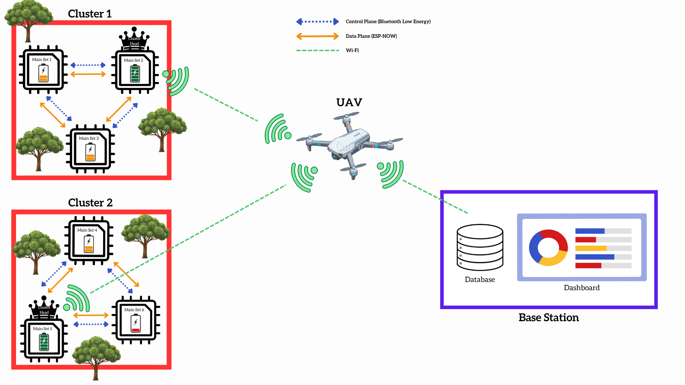

# WSNDataFerry Organization

Welcome to **WSNDataFerry**, an open-source initiative focused on autonomous data collection and management in **Wireless Sensor Networks (WSNs)** deployed in disconnected or remote environments.

---

## Organization Overview

WSNDataFerry develops modular software and hardware solutions for:

- Autonomous UAVs for data muling in WSNs
- Base station dashboards for mission planning and data visualization
- ESP32-S3 based WSN sensor node firmware
- Scalable and maintainable network stack solutions

### UAV System Architecture



---

## Repositories

| Repository | Language | Description |
|------------|----------|-------------|
| [uav_companion](https://github.com/WSNDataFerry/uav_companion) | Python | UAV onboard compute module — ROS 2 Humble mission manager, waypoint flight, and WSN data collection node running on a Raspberry Pi companion computer |
| [WSN_main_set](https://github.com/WSNDataFerry/WSN_main_set) | C (ESP-IDF) | ESP32-S3 WSN sensor node firmware — BLE neighbor discovery, ESP-NOW clustering, STELLAR cluster-head election, TDMA data collection, SPIFFS storage with compression, and UAV/RF onboarding |
| [Basestation-Dashboard](https://github.com/WSNDataFerry/Basestation-Dashboard) | JavaScript | Base station dashboard for mission planning and collected data visualization |
| [Autonomous-data-ferrying](https://github.com/WSNDataFerry/Autonomous-data-ferrying) | — | Test demos and proof-of-concept experiments for the autonomous data ferrying pipeline |

---

## Getting Started

1. **Clone the UAV companion workspace with submodules:**

```bash
git clone --recursive https://github.com/WSNDataFerry/uav_companion.git
```

2. **Clone the WSN sensor node firmware:**

```bash
git clone --recursive https://github.com/WSNDataFerry/WSN_main_set.git
```

3. **Update submodules (if cloned without `--recursive`):**

```bash
git submodule update --init --recursive
```

4. Follow each repository's README for setup instructions.

---

## System Architecture

The full system consists of three layers working together:

- **WSN Nodes** (`WSN_main_set`) — ESP32-S3 based sensor nodes that form a self-organising cluster using STELLAR, store data locally in SPIFFS, and wait for UAV contact via RF trigger or Wi-Fi.
- **UAV Companion** (`uav_companion`) — Raspberry Pi running ROS 2 that flies the drone through GPS waypoints, wakes up each WSN node via RF, opens a Wi-Fi hotspot, and collects data over HTTP.
- **Base Station** (`Basestation-Dashboard`) — Ground-side dashboard for mission planning, monitoring, and visualising collected sensor data.

---

## Contribution Guidelines

- Fork the repository you want to contribute to.
- Create a feature branch: `git checkout -b feature/your-feature`
- Commit your changes: `git commit -m "Add some feature"`
- Push to your branch and submit a Pull Request.

Please read each repo's README for specific contribution instructions.

---

## License

All repositories under **WSNDataFerry** are licensed under [MIT License](LICENSE) unless stated otherwise.

---

## Contact

For questions, feedback, or collaborations:

- Email: [chandupachiranjewa@gmail.com](mailto:chandupachiranjewa@gmail.com)
- GitHub: [WSNDataFerry](https://github.com/WSNDataFerry)
